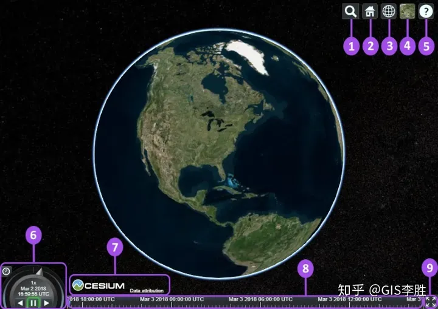

Cesium.js 提供的组件

1. Geocoder：查找位置工具，查找到之后会将镜头对准找到的地址，默认使用微软的 Bing 地图
2. HomeButton：首页位置，点击之后将视图跳转到默认全球视角
3. SceneModePicker：选择视角的模式，3D，2D，哥伦布视图(CV)
4. BaseLayerPicker：图层选择器，选择要显示的地图服务和地形服务 viewer.baseLayerPicker
5. NavigationHelpButton：导航帮助按钮，显示默认的地图控制帮助
6. Animation：动画器件，控制视图动画的播放速度
7. CreditsDisplay：展示商标版权和数据归属
8. Timeline：时间轴，指示当前时间，并允许用户跳到特定的时间
9. FullscreenButton：全屏按钮
