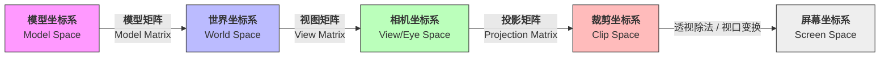

WebGL 是基于 Web 的 3D API，基于 OpenGL ES 改造而来，且仅仅是一个光栅化的 API

## 渲染流程

WebGL 流程

### Step1: CPU 初始化和准备资源

1.  初始化画布，获取上下文
2.  编译 Shader 和 Link Program
    1. 创建 Vertex Shader 和 Fragment Shader
    2. 编译 GLSL 源代码，检查编译错误
    3. 将两者链接到 WebGLProgram 中，并使用该 Program
3.  准备数据（VBO 与 Attribute）
    1. 准备顶点数据
    2. 创建缓冲区
    3. 绑定缓冲区，向缓冲区写入数据
    4. 设置属性指针并启动属性
4.  传递其他值，例如 uniform
5.  调用绘制命令（CPU 发送给 CPU 启动指令）

### Step2: GPU 渲染管线

    1.  顶点着色器：计算顶点的裁剪坐标、法线等
    2.  图元装配：根据顶点模式，组合几何形状
    3.  光栅化：将几何图形离散化为屏幕像素点
    4.  片元着色器：决定像素点的最终颜色
    5.  逐片元操作
        1. 深度测试
        2. 混合：处理透明度
    6.  写入帧缓冲区

## 坐标系

WebGL 使用裁剪坐标系，以右手螺旋定则

- X 为左右，从左至右为 [-1,1]
- Y 为上下，从上至下为 [1,-1]
- Z 为里外，从里到外为 [-1,1]

## 变换

1. 世界坐标系
2. 模型坐标系、模型矩阵：模型坐标系通过模型矩阵，转换为世界坐标系
3. 相机坐标系、相机矩阵：
4. 视图矩阵：世界坐标系通过视图，转换为相机坐标系
5. 投影坐标系、投影矩阵：相机坐标系通过投影矩阵，转换为投影坐标系（裁剪坐标系）

视图矩阵和相机矩阵：相机可以通过相机矩阵，转换为世界坐标，然后就可以计算相机看向模型了，但是如此计算不直观，较为直观的是，将相机摆放于原点，移动模型的位置，从而致使相机和模型的位置相对不变，即采用视图矩阵

模型法线：模型变化时，使用模型矩阵换算坐标，但是法线，需要使用 **模型矩阵的逆矩阵的转置矩阵**换算

## 光照

简易光照模拟

1. 平行光

   以平行光照射的方向 点乘 物体的法向，可以得到 [-1,1] 的数，此为光照强度，当 强度 < 0 后，就不接受光照了

2. 点光源

   设想光是一个点，朝四面八方照射。点光源到物体为光照的入射方向 点乘 物体的法向，计算结果类似平行光，只是照射角度不同

3. 聚光灯

   设想光是一个点，具有照射角度，按照点光源计算出余弦后，根据聚光灯的照射角度，判定是否在范围内，如果在范围，则被照亮

   聚光灯一般也可以照亮周围的，而上述方法照亮和未照亮，被生硬的切割，可以设定一个范围内的插值
