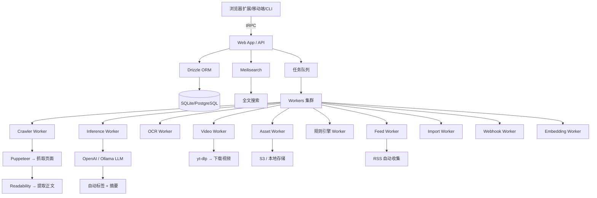

# Karakeep 项目分析报告

> **GitHub**: https://github.com/karakeep-app/karakeep  
> **Stars**: 27.2k · **Forks**: 1.3k · **License**: AGPL-3.0  
> **语言**: TypeScript · **始创**: 2024-02 · **活跃**: 🔥 持续活跃

Karakeep（原 Hoarder）是一个**自托管的全能书签工具**，支持收藏链接、笔记、图片和 PDF，并内置 AI 自动标签和全文搜索。定位是"书签一切"的**数据囤积者利器**。

---

## 一、项目总览

| 维度     | 评价                                                            |
| -------- | --------------------------------------------------------------- |
| 项目类型 | 自托管书签管理 + Read-it-later + AI 增强                        |
| 技术壁垒 | 中 — 涉及 RSS/全文抓取/OCR/LLM 等多个子系统                     |
| 学习价值 | 高 — 了解完整全栈应用架构、AI 集成模式、Worker 体系设计         |
| 商业价值 | 中高 — 有 SaaS 云服务 (cloud.karakeep.app) + Stripe 订阅集成    |
| 适合人群 | 自托管爱好者、数据囤积者、需要跨平台书签同步的开发者            |
| 核心创新 | AI 自动标签 + 全文搜索 + 多格式支持（链接/笔记/图片/PDF）一体化 |

---

## 二、技术栈

| 层面       | 技术选型                                                                     |
| ---------- | ---------------------------------------------------------------------------- |
| 前端 Web   | **Next.js 16** (App Router) + React 19 + Tailwind CSS + Radix UI + shadcn/ui |
| 前端移动端 | **React Native 0.81** + **Expo 54** + NativeWind                             |
| 后端 API   | **Hono** (轻量 Web 框架) + **tRPC** (类型安全通信)                           |
| 数据库     | **Drizzle ORM** + SQLite/PostgreSQL (通过 better-sqlite3)                    |
| 搜索引擎   | **Meilisearch** (全文搜索)                                                   |
| AI         | **OpenAI API** / **Ollama** (本地模型) — 自动标签、摘要                      |
| 浏览器抓取 | **Puppeteer** + **Readability** (类 Reader 模式)                             |
| OCR        | 内置 OCR 从图片提取文字                                                      |
| 视频归档   | **yt-dlp** 自动下载视频                                                      |
| 页面归档   | **Monolith** 完整保存网页防链接失效                                          |
| 任务队列   | Restate / LiteQue（双队列实现可选）                                          |
| 认证       | **NextAuth (Auth.js)**                                                       |
| 构建工具   | **Turborepo** + pnpm Workspace                                               |
| CI/质量    | Oxlint + Oxfmt + Vitest + Husky                                              |

---

## 三、项目架构

### Monorepo 结构

```
karakeep/
├── apps/
│   ├── web/                 # 主 Web 应用 (Next.js)
│   ├── mobile/              # 移动端 (React Native / Expo)
│   ├── workers/             # 后台 Worker 集群
│   ├── cli/                 # 命令行工具
│   ├── mcp/                 # Model Context Protocol 服务 (AI Agent 接入)
│   ├── browser-extension/   # 浏览器扩展
│   └── landing/             # 官网 landing page
├── packages/
│   ├── api/                 # Hono + tRPC API 层
│   ├── db/                  # Drizzle 数据库 Schema 和迁移
│   ├── trpc/                # tRPC 路由和业务逻辑（核心！）
│   ├── shared/              # 共享类型和工具
│   ├── shared-server/       # 服务端共享逻辑
│   ├── shared-react/        # 共享 React 组件/Hooks
│   ├── sdk/                 # 客户端 SDK
│   ├── plugins/             # 可插拔后端组件（队列/搜索/限流）
│   ├── open-api/            # OpenAPI 规范
│   └── benchmarks/          # 性能基准测试
├── docker/                  # Docker Compose 编排
├── kubernetes/              # K8s 部署配置
└── charts/                  # Helm Charts
```

### 架构数据流



### Worker 系统详解

Worker 是 Karakeep 最核心的后台系统，基于 **Restate** 或 **LiteQue** 实现可靠任务队列：

| Worker                     | 职责                                                      |
| -------------------------- | --------------------------------------------------------- |
| `crawlerWorker`            | 抓取书签 URL，用 Puppeteer + Readability 提取正文和元数据 |
| `inferenceWorker`          | 调用 LLM 进行自动标签 + 摘要生成                          |
| `embeddingsWorker`         | 生成向量嵌入（语义搜索）                                  |
| `assetPreprocessingWorker` | 预处理上传的图片/PDF 资源                                 |
| `videoWorker`              | 用 yt-dlp 下载视频归档                                    |
| `feedWorker`               | 定时抓取 RSS 源自动入库                                   |
| `ruleEngineWorker`         | 执行用户自定义规则（自动分类/标签）                       |
| `importWorker`             | 从 Pocket/Linkwarden/Omnivore 等导入数据                  |
| `backupWorker`             | 自动备份                                                  |
| `searchWorker`             | 搜索索引维护                                              |
| `webhookWorker`            | 触发 Webhook 通知                                         |
| `adminMaintenanceWorker`   | 后台管理维护任务                                          |

### 插件系统

`packages/plugins/` 实现了一套可插拔后端组件：

| 插件         | 实现                                   | 说明                 |
| ------------ | -------------------------------------- | -------------------- |
| **队列**     | `queue-restate` / `queue-liteque`      | 任务队列双实现       |
| **搜索**     | `search-meilisearch`                   | Meilisearch 搜索引擎 |
| **向量存储** | `vectorstore-meilisearch`              | 向量嵌入存储         |
| **限流**     | `ratelimit-redis` / `ratelimit-memory` | 速率限制             |

---

## 四、横向对比

| 对比项         | Karakeep                 | Linkwarden        | Wallabag        | Memos         | Pocket (已关停) |
| -------------- | ------------------------ | ----------------- | --------------- | ------------- | --------------- |
| ⭐ Stars       | 27.2k                    | 9k+               | 14k+            | 37k+          | -               |
| 技术栈         | TypeScript/Next.js       | TypeScript/Nuxt   | PHP/Symfony     | Go + React    | -               |
| 自托管         | ✅ Docker/K8s/Helm       | ✅ Docker         | ✅ Docker       | ✅ Docker     | ❌              |
| AI 功能        | ✅ 自动标签+摘要+OCR     | ❌                | ❌              | ❌            | ❌              |
| 全文搜索       | ✅ Meilisearch           | ✅ 基础搜索       | ✅ 全文搜索     | ❌ 基础搜索   | ❌              |
| 移动端         | ✅ RN + Expo 双平台      | ✅ PWA            | ✅ 各平台客户端 | ✅ 移动端 Web | ✅（已关停）    |
| 浏览器扩展     | ✅ Chrome/Firefox/Safari | ✅ Chrome/Firefox | ✅ 多浏览器     | ❌            | ✅              |
| 多格式支持     | ✅ 链接/笔记/图片/PDF    | 主要链接          | 主要文章        | 笔记为主      | 主要链接        |
| RSS 自动收集   | ✅                       | ❌                | ❌              | ❌            | ❌              |
| 协作           | ✅ 列表级别协作          | ✅ 协作收藏       | ❌              | ❌            | ❌              |
| 离线阅读       | ⏳ 计划中                | ❌                | ✅              | ❌            | ✅              |
| LLM Agent 接口 | ✅ CLI + MCP + SDK       | ❌                | ❌              | ❌            | ❌              |
| 页面归档       | ✅ Monolith 全页存档     | ❌                | ❌              | ❌            | ❌              |
| 视频归档       | ✅ yt-dlp                | ❌                | ❌              | ❌            | ❌              |

### 优劣势总结

| 维度        | Karakeep                                     | Linkwarden             | Wallabag            |
| ----------- | -------------------------------------------- | ---------------------- | ------------------- |
| ✅ 最大优势 | AI 自动分类 + 多格式 + Agent 接口            | 简朴稳定、协作收藏好   | 成熟稳定、生态丰富  |
| ❌ 最大短板 | 仍在快速迭代中，配置复杂                     | 功能较单一、缺 AI 能力 | 技术栈较老、UI 朴素 |
| 🎯 差异化点 | 数据囤积者全栈方案：从链接到图片到视频一条龙 | 专注链接书签协作       | 专注 Read-it-later  |

---

## 五、值得关注的设计亮点

### 1. Restate 驱动的可靠 Worker 系统

Karakeep 使用 [Restate](https://restate.dev/) 作为可选的 Worker 队列实现。Restate 是一个**有状态函数运行时**，提供内置的持久化执行保证——即使 Worker 进程崩溃，任务也不会丢失。这在 Crawler（需要长时间浏览器操作）和 Inference（需要大模型调用）等场景非常关键。设计上可选回退到 LiteQue（基于 SQLite 的轻量队列），体现了"从简单到可靠"的递进式架构哲学。

### 2. 插件化后端组件抽象

`packages/plugins/` 对队列、搜索、限流、向量存储做了接口抽象，每个组件都有多个实现（如队列可以有 Restate 或 LiteQue）。这种设计让用户可以按自己的基础设施选择方案——小规模用 SQLite+LiteQue，大规模用 Restate+Redis。

### 3. 多 Agent 接口（MCP + CLI + SDK）

Karakeep 提供了 **MCP (Model Context Protocol)** 服务，让 Claude、Hermes 等 AI Agent 可以直接原生操作书签。同时还有 CLI 工具和 TypeScript SDK。这是当前自托管工具中最前卫的设计——让大模型 Agent 能像人一样使用书签系统。

### 4. 规则引擎

用户可定义触发规则（如"当收藏包含 AI 相关内容的链接，自动打上 #AI 标签并加入 '研究' 列表"），实现自动化管理。规则解析使用了 `typescript-parsec` 实现自定义 DSL 解析。

### 5. 全面的数据导入/导出

支持从 Chrome/Pocket/Linkwarden/Omnivore/Tab Session Manager 导入，支持 floccus 同步浏览器书签。数据可迁移性是这个项目的重要卖点。

---

## 六、潜在问题与注意

1. **配置复杂**：需要同时设置 PostgreSQL/SQLite + Meilisearch + Chrome (Puppeteer) + 可选的 OpenAI/Ollama，docker-compose 下来至少 3 个服务
2. **仍在快速迭代**：README 明确标注 under heavy development，API 可能不稳定
3. **AI 功能有成本**：如果使用 OpenAI API 做自动标签，会产生 API 费用；使用 Ollama 本地模型则需要足够硬件（GPU）
4. **Puppeteer 依赖**：核心抓取能力依赖 Chrome/Chromium，增加资源占用
5. **移动端体验**：React Native + Expo 实现，相比原生体验可能有差距
6. **661 个 Open Issues**（截至分析日）：项目活跃但 issue 积压不少

---

## 七、选型建议

- ✅ **选 Karakeep 当**：你需要一个自托管的"数字生活全归档"方案，不仅收藏链接，还要包含笔记、图片、PDF 和视频；你希望 AI 自动帮你分类和管理
- ✅ **选 Linkwarden 当**：你只需要一个简单的团队链接书签管理，不需要 AI 和复杂归档
- ✅ **选 Wallabag 当**：你只需要纯粹的 Read-it-later 文章保存和离线阅读，追求老牌稳定
- ✅ **选 Memos 当**：你主要想记笔记、不需要链接自动预览和全文搜索
- ⚠️ **不想折腾 Docker + 不想付费 API**：考虑使用托管版 cloud.karakeep.app，或等它更成熟

---

## 八、总结

**一句话定位**：Karakeep 是目前开源自托管领域最激进的"数据囤积"方案——它不满足于只收藏链接，而是试图成为你数字生活的中枢，通过 AI 自动管理你收藏的一切（链接、笔记、图片、PDF、甚至视频）。

**最值得关注的点**：

1. **AI 自动化程度**：自动标签 + 摘要 + OCR，让收藏不再"收而不理"
2. **MCP/CLI Agent 接口**：这是面向 AI 时代的书签管理设计，Agent 可以自主操作
3. **Worker 架构设计**：Restate + 插件化队列的实践值得学习
4. **全格式支持**：从链接到视频的全面归档能力

**学习建议**：如果你想学习一个完整的 Next.js 16 + tRPC + Drizzle ORM + Worker 架构的全栈项目，Karakeep 是很好的参考。想直接用的用户建议先试用 Demo（try.karakeep.app），确认符合需求再部署。

---

_分析日期: 2026-07-09_
