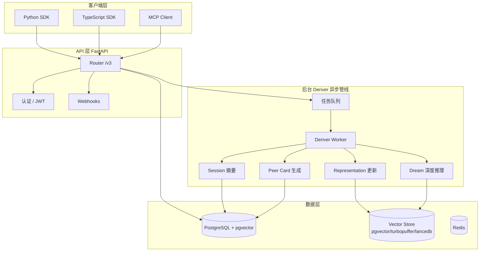

# Honcho — Agent 记忆基础设施

> 项目地址：<https://github.com/plastic-labs/honcho>
> Python SDK：`honcho-ai` · TypeScript SDK：`@honcho-ai/sdk`
> 文档：<https://honcho.dev/docs/>

## 项目总览

| 维度 | 评价 |
|------|------|
| 项目类型 | Agent 记忆基础设施 / LLM 身份管理层 |
| 技术栈 | Python (FastAPI) + PostgreSQL/pgvector + 多 LLM Provider |
| ⭐ Stars | ~5,929 |
| 许可证 | AGPL-3.0 |
| SDK | Python + TypeScript 双 SDK，MCP 协议支持 |
| 活跃度 | 2023-09 创建，持续高频更新 |
| 核心创新 | **Peer 范式** — 人和 AI 统一建模 + 异步推理管线 |

## 解决的核心问题

构建长期陪伴用户的 AI 助手时，开发者面临三个困境：

1. **记忆无法持久** — 每次对话 AI 都"不记得上次说了什么"
2. **Context Window 有限** — 塞历史记录会迅速耗尽 token
3. **缺乏深度理解** — 向量搜索只能找回片段，无法推理用户的性格、偏好

Honcho 的解法：**记忆即服务，存储只占 20%，80% 是推理**。开发者只负责存消息和事件，Honcho 在后台异步推理，构建每个人的"身份画像"（Representation），通过 Chat Endpoint 或 Context API 供任何 LLM 消费。

## 架构全景



## Honcho Loop（核心流程）

```
Step 1: Store ──→ Step 2: Reason ──→ Step 3: Query ──→ Step 4: Inject
   (存对话/事件)   (后台异步推理)     (取上下文/结论)   (注入 LLM 调用)
```

- **Store** — 存消息、事件、文件到 Session
- **Reason** — Deriver 后台消费队列，更新 Representation
- **Query** — 通过 Chat Endpoint / Context API / Search 取数据
- **Inject** — 直接转 `.to_openai()` / `.to_anthropic()` 格式喂给 LLM

## 数据模型：Peer 范式

```
Workspace
├── Peer (用户 或 AI 代理，统一建模)
│   ├── Session（多对多）
│   └── 内部 Collections (observer, observed)
│       └── Documents（向量嵌入）
└── Session
    ├── Peer（参与方）
    └── Message（原子数据单元）
```

核心概念：

- **Workspace** — 顶层容器，隔离不同 use case 的数据
- **Peer** — 任何参与者，**人和 AI 代理是对称的，都叫 Peer**
- **Session** — 对话上下文，多个 Peer 可参与同一个 Session
- **Message** — 原子数据单元，标注来源 Peer
- **Collections** — 内部向量集合，按 `(observer, observed)` Peer 对建索引

## 深度技术亮点

### 1. Dialectic（Chat Endpoint）多级推理引擎

`/peers/{peer_id}/chat` 是旗舰接口。它不是简单 RAG，而是**分层次推理**：

| 级别 | 成本 | 行为 |
|------|------|------|
| none | 零 | 不推理，只返回已有结论 |
| minimal/low | 低 | 基于 Representation 直接检索 |
| medium | 中 | 融合当前对话上下文 + 长期结论 |
| high/xhigh | 高 | 多步推理，跨 Session 关联 |
| max | 最高 | 带批判反思的深度推理 |

每级可配置不同的 LLM Provider（默认 low 走 Gemini，high/max 走 Anthropic）。这种**分层成本控制**很实用——日常请求用 low 不烧钱，深度分析才走高成本推理。

### 2. Deriver 异步推理管线

```
消息创建 → 入队
├── representation → 更新 (observer, observed) 向量集合
├── summary → 逐 Session 摘要
├── peer_card → 紧凑身份卡片（供快速上下文注入）
└── dream → 周期性深度分析（低负载时段触发的"反刍"）
```

**Dream 机制**最有趣——它不是在每次消息后推理，而是在低负载时段主动扫描已有结论，用新增消息验证/修正旧假设（surprisal 机制）。发现矛盾就更新 Representation。这是最接近"Agent 自我进化"的实践。

### 3. CQRS + 异步处理

写入路径（消息存 PG + 入队）保持 O(1) 低延迟，Deriver 可水平扩展。这是经典 CQRS 模式在 Agent 记忆系统的应用——**推理很贵，不能让它在请求路径上阻塞**。

### 4. 向量后端可插拔

| 后端 | 场景 |
|------|------|
| pgvector | 默认，同 PG 事务 |
| turbopuffer | 高性能独立向量 |
| lancedb | 嵌入式 / 离线 |

默认为同库 pgvector，免去运维多套存储；生产规模可切到独立向量 DB。

### 5. 跨模型 Provider 灵活

通过配置可混用多个 LLM Provider 做不同任务：

- Gemini — embedding、deriver、summary、dialectic low
- Anthropic — dialectic medium/high/max、dream
- OpenAI — embedding 备用

## 竞品对比

| 对比项 | Honcho | Mem0 | Letta (原 MemGPT) | Zep |
|--------|--------|------|--------------------|-----|
| ⭐ Stars | ~5,900 | ~25k+ | ~20k+ | ~3k+ |
| 核心范式 | Peer 统一模型 | 用户记忆存取 | 虚拟上下文管理 | 长时记忆服务 |
| 推理能力 | ✅ 多级 Dialectic | ❌ 纯检索 | ✅ 自主记忆管理 | ❌ 存储优先 |
| 异步处理 | ✅ Deriver 后台 | ❌ 同步 | ✅ 层级记忆 | ✅ 后台处理 |
| 自托管 | ✅ Docker | ✅ Docker | ✅ Docker | ✅ Docker |
| SDK | Python + TS | Python + JS | Python | Python + JS |
| 向量后端 | pgvector/turbopuffer/lancedb | 多种 | 本地 | Pinecone/Qdrant |
| LLM 集成 | Chat Endpoint 直出 | 手动取 | 内置记忆 | 手动取 |
| 许可证 | AGPL-3.0 | Apache 2.0 | Apache 2.0 | MIT / 商业 |

## 选型建议

- ✅ **选 Honcho**：需要用户身份建模、长期陪伴型 AI、多 Agent 协作系统
- ✅ **选 Mem0**：需要快速集成、轻量记忆、宽松许可证（Apache 2.0）
- ✅ **选 Letta**：需要 Agent 自主管理记忆、研究工作
- ✅ **选 Zep**：商业 SaaS 场景、需要企业级支持

## 优劣势总结

### ✅ 最大优势

1. **Peer 范式独一无二** — 人和 AI 统一建模，支持"A 对 B 的认知"
2. **推理泵而非存储泵** — 不只是存嵌入，而是用 LLM 推理出结论
3. **Chat Endpoint 开箱即用** — 一行代码获取 LLM-ready 上下文
4. **分层推理成本控制** — Dialectic 级别设计让开发者自由权衡质量与成本
5. **嵌入生态深** — Claude Code 插件、OpenCode、OpenClaw、Hermes、MCP

### ❌ 最大短板

1. **AGPL-3.0 许可证** — 商业闭源必须开源衍生作品
2. **PostgreSQL 强依赖** — 部署复杂度高于纯内存方案
3. **异步推理延迟** — 消息写入后不能立即读到结论
4. **API 仍在快速变化** — 165+ open issues，生产稳定性需评估

## 架构设计哲学

**为什么选异步 Deriver 而非同步？** 推理很贵。如果每次消息都做 LLM 调用更新 Representation，延迟和成本都不可控。异步队列 + CQRS 让写入路径保持 O(1)，deriver 可水平扩展。

**为什么不直接用向量数据库？** 向量数据库只能做语义搜索，不能推理。Honcho 的核心洞察：**记忆的价值不在于检索精确度，而在于推导出的结论质量**。"用户喜欢什么颜色"可以靠关键词，但"用户的购买决策风格是冲动型还是分析型"需要推理。

**Peer 范式 vs 传统 user 范式？** 传统记忆系统只有"用户"一个维度。Peer = 统一主体意味着同一个框架里可建模：用户对 AI 的看法、AI 对用户的建模、多 AI 协作——在多 Agent 场景中是结构性优势。
